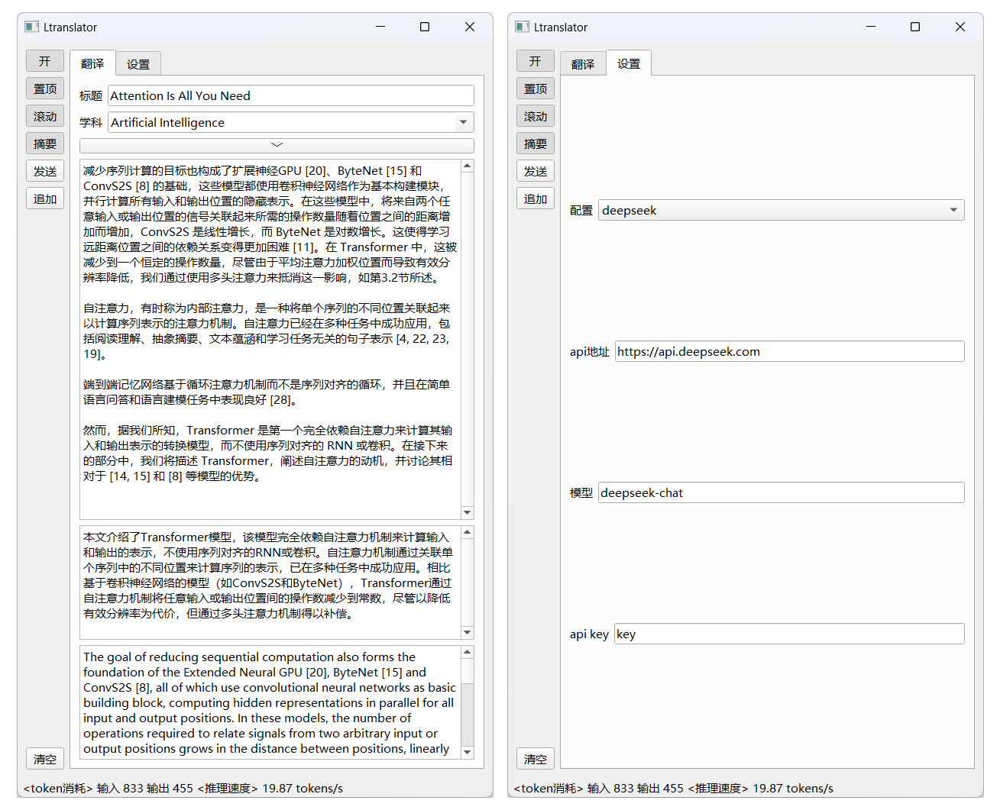

# Ltranslator

#### 介绍
目前，现有的文献翻译软件包括两类，一类是将翻译器与PDF阅读器捆绑在一起，必须在指定的PDF阅读器中打开文件才能进行翻译，如[小绿鲸](https://www.xljsci.com/)和[知云文献翻译](https://www.zhiyunwenxian.cn/)。另一类是将翻译器与PDF阅读器分离，用户可以在任何软件中选中文本、启动翻译，其适用范围更广，如知云团队开发的[Xtranslator](https://www.zhiyunwenxian.cn/winx.html)。

文献翻译软件所使用的翻译方式也有两种，一种是调用百度、有道等传统翻译引擎进行翻译，另一种是调用大语言模型进行翻译。一般而言，后者的翻译效果要优于前者。此外，得益于大模型API的大幅度降价，从大模型厂商处自行申请API Key用于文献翻译已经是一种非常经济的做法。目前，对于能力介于GPT-3.5级别和GPT-4级别之间的大模型，每百万token的售价大约在1元左右，如果每天消耗1万token，则一年的费用也仅有3.65元，这还不包括大模型厂商提供的免费额度。

Xtranslator的Windows版虽然提供了大模型翻译功能，但截至2024-10-10，Xtranslator的最新版（2.8.0C）只支持GPT和通义千问两种大模型，此外，如果要使用大模型翻译功能，还需要向知云购买API Key，笔者尝试将自己在阿里云申请的通义千问API Key填写在Xtranslator中，结果软件出现报错，提示API Key存在错误，最终无法使用大模型翻译功能。

此外，Xtranslator使用的是非跨平台技术，Windows版和Mac版需要用不同的框架进行开发，无法做到“一次编写，处处运行”，Mac版的功能与Windows版相比存在欠缺，且至今没有推出Linux版。

Ltranslator则是一款完全基于大模型的跨平台文献翻译工具，操作方式与Xtranslator相似，但支持任何具有OpenAI-compatible API的云端大模型和本地大模型，支持Windows、Linux和Mac系统，可以成为Xtranslator的开源平替。

（图中论文：Vaswani A, Shazeer N, Parmar N, et al. Attention is All you Need: NIPS, Long Beach, 2017[C].）

#### 软件架构
使用Python中的openai库调用大语言模型
使用pyside2库搭建用户界面
使用pynput库监听快捷键是否被按下
使用pyperclip库读取剪贴板内容
使用pyyaml库读取配置文件

#### 安装教程

1.  安装[Python](https://www.python.org/) 3.6≤版本≤3.10（对于Linux系统，请确保Python中安装了pip和venv两个模块，并在系统中安装了xclip）
2.  下载本项目，在项目所在文件夹内打开终端
3.  `python3 install.py`
4.  安装完成后，双击“Ltranslator启动器”即可运行（在mac系统中，为实现通过按键触发相应函数，脚本需要以管理员权限运行，因此会提示输入密码。在Linux系统中，如果双击“Ltranslator启动器”后执行的操作是显示该文件的内容而不是启动翻译器，请修改文件管理器的设置，例如，对于gnome桌面自带的Nautilus文件管理器，请在“首选项”-“行为”-“可执行文本文件”中选中“每次都询问”或“打开可执行文本文件时运行它们”。）

#### 使用说明

1.  可以通过编辑config.yaml来更改“学科”下拉列表中的选项以及“配置”选项卡中的模型厂商、api_key、模型名称、url等
2.  快捷键：选中文本后，按CapsLock立即启动翻译，按Esc可将选中的文本追加到待翻译的原文中
3.  侧边按钮
    |名称|作用|
    |-|-|
    |开/关|按下后，打开翻译功能|
    |置顶|按下后，Ltranslator窗口会始终保持在所有窗口的最上方|
    |滚动|按下后，当有新的译文生成时，译文浏览框会自动滚动到最下方|
    |摘要|按下后，在翻译的同时还会自动生成摘要|
    |发送|将待翻译的原文发送给大模型，开始翻译|
    |清空|清空原文文本框|
4.  调用本地大模型：使用[llama.cpp](https://github.com/ggerganov/llama.cpp)或[vllm](https://github.com/vllm-project/vllm)等工具启动一个OpenAI-compatible server，再修改config.yaml中“本地”选项的内容即可

